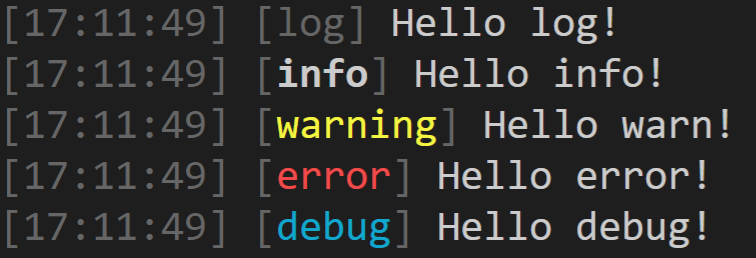

# Introduction



Javascript comes by default with different standardized logging types. But as it stands only browsers are taking advantage of these different methods of logging. `better-logging` aims to improve the default logging experience of any node application, it is designed to be a drop in replacement for the default logging methods. Since `better-logging` only decorates the default logging methods you won't lose any functionality provided by other tooling. `better-logging` is not meant to be the be all and end all of node.js logging. It is just supposed to increase the usefulness of the default logging methods.

```javascript
// Default in node.js
console.debug('foo'); //  foo
console.log('foo'); //    foo
console.info('foo'); //   foo
console.warn('foo'); //   foo
console.error('foo'); //  foo

// With better-logging
require('better-logging')(console);

console.debug('foo'); //  [11:46:35] [debug] foo
console.log('foo'); //    [11:46:35] [log] foo
console.info('foo'); //   [11:46:35] [info] foo
console.warn('foo'); //   [11:46:35] [warn] foo
console.error('foo'); //  [11:46:35] [error] foo
console.line('foo'); //   foo
```

Better-logging calls the default implementation in the background.

```javascript
require('better-logging')(console);
console.info('Hello World');
// Is the same as
console.info('[11:46:35] [info] Hello World')
```
